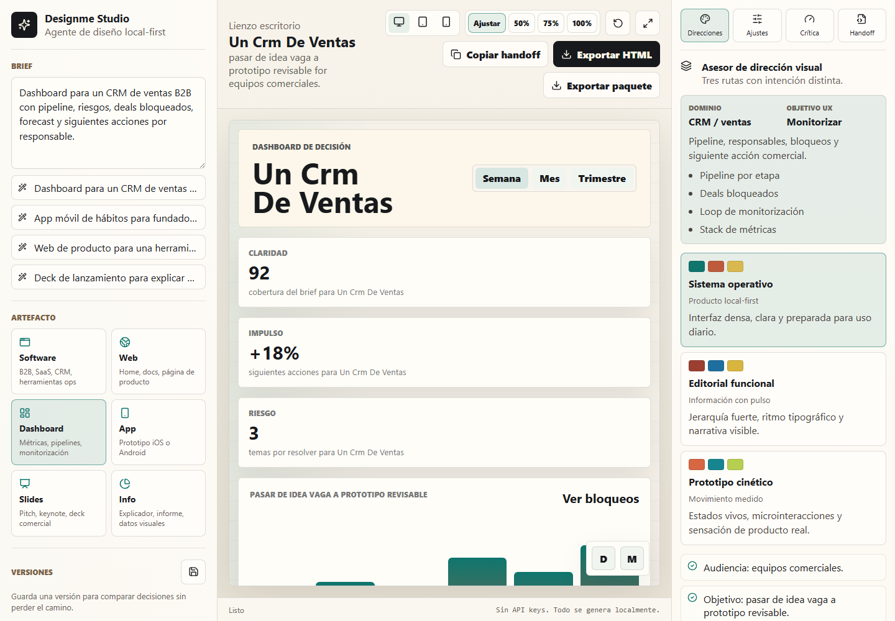
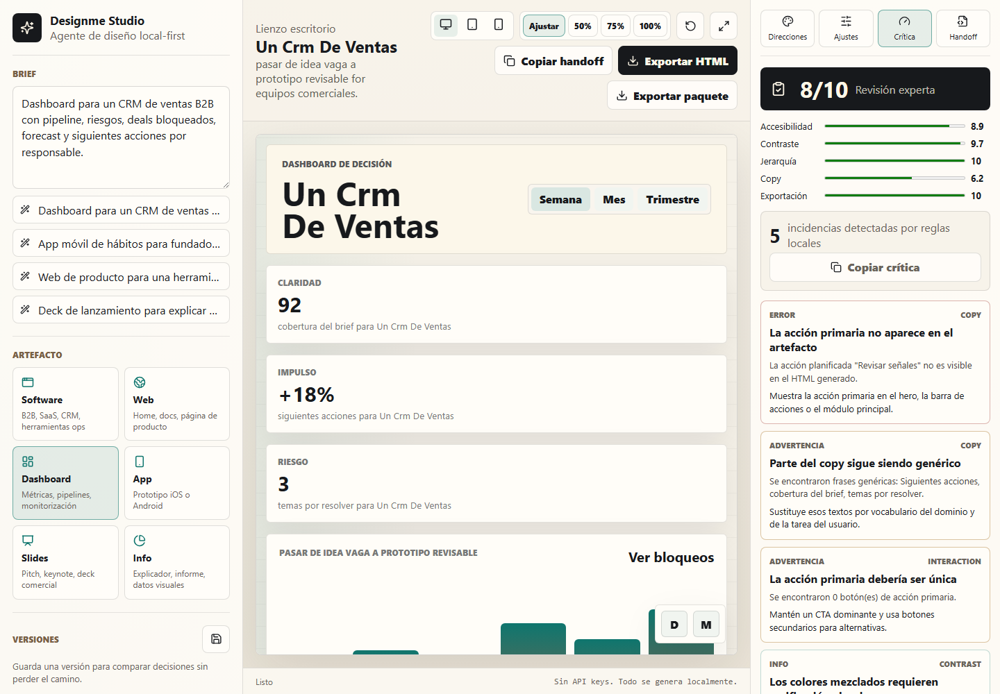
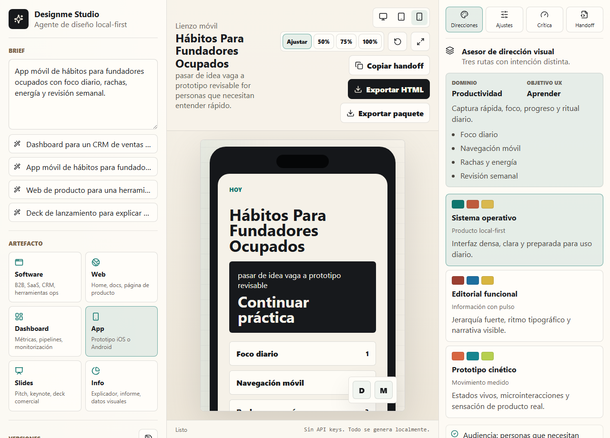
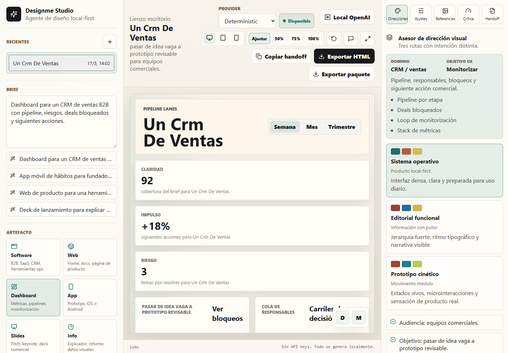
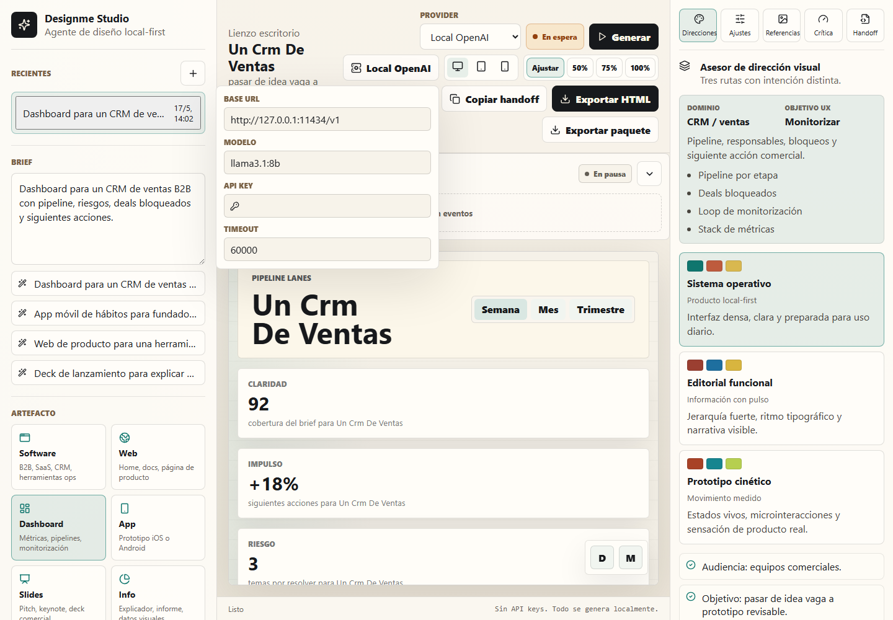
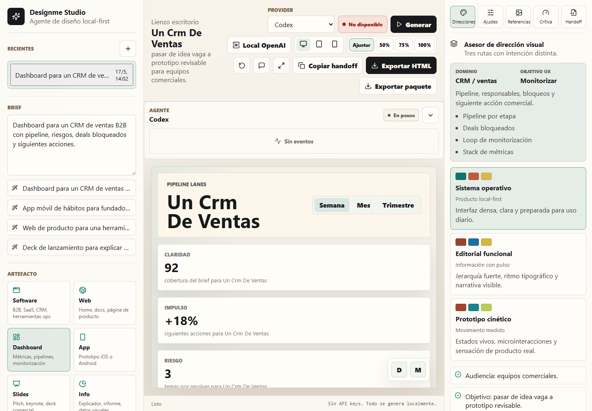

# Designme Studio

Designme Studio es un diseñador local-first para apps, pantallas de software, dashboards, decks, infografías y webs. Funciona offline con un motor determinista y, cuando el usuario lo pide, puede generar con providers externos: Local OpenAI/Ollama, Claude Code o Codex.

La versión `0.2.0` mantiene la filosofía de control local: no hay proveedor cloud obligatorio, los providers no deterministas se ejecutan solo con el botón `Generar`, y las credenciales se gestionan fuera de Designme o quedan solo en memoria de sesión.

## Funcionalidades

- Generador determinista local, sin API key ni red.
- Provider OpenAI-compatible configurable para Ollama, LM Studio, vLLM o gateways BYOK.
- Providers de escritorio para Claude Code y Codex usando los CLI ya autenticados del usuario.
- Detección one-click de Claude Code, Codex y Ollama en la app desktop.
- Streaming de tokens, tool calls, resultados y botón `Stop` en el panel de agente.
- Sesiones recientes, versiones guardadas y modo de comentarios sobre el preview.
- Vista previa en lienzos de escritorio, tablet y móvil.
- Direcciones visuales respaldadas por tokens de diseño compartidos.
- Ajustes de densidad, tono, movimiento, radio y marco de dispositivo.
- Referencias locales: notas visuales/textuales que se convierten en preferencias, no en copia ciega.
- Mejora local del brief sin llamadas externas ni API key.
- Panel de crítica con rúbrica de calidad y puntuación sensible a contraste.
- Analizador local de accesibilidad, jerarquía, layout, copy, contraste y exportación.
- Exportación HTML y paquete estructurado con `index.html`, `styles.css`, `script.js`, `designme.json`, `handoff.md` y README.
- Electron endurecido con CSP, IPC validado por origen y sandbox de preview más estricto.

## Capturas







### Providers








## Quick Start

```bash
npm install
npm run dev
```

Esto arranca Vite y Electron. Para probar solo la versión web:

```bash
npm run web
```

## Providers

Designme tiene cuatro providers:

| Provider | Dónde corre | Requiere | Cuándo genera |
|---|---|---|---|
| `deterministic` | Renderer local | Nada | Automático con debounce |
| `local-openai` | Endpoint OpenAI-compatible | Servidor/modelo; API key opcional | Solo al pulsar `Generar` |
| `claude-code` | Electron + CLI `claude` | Claude Code instalado y autenticado | Solo al pulsar `Generar` |
| `codex` | Electron + CLI `codex` | Codex instalado y autenticado | Solo al pulsar `Generar` |

Más detalle en [`docs/providers.md`](docs/providers.md).

### BYOK Y Local OpenAI

`Local OpenAI` permite apuntar a cualquier endpoint compatible con `/chat/completions` y streaming SSE. Por defecto usa:

```txt
http://127.0.0.1:11434/v1
```

La API key es opcional. Si se introduce, se envía como `Authorization: Bearer ...` en la petición, pero Designme no la guarda en `localStorage`; solo persiste `baseUrl`, `model` y `timeoutMs`.

### Ollama

En escritorio, Designme busca Ollama en `http://127.0.0.1:11434/api/tags`. Si responde, muestra `Usar Ollama`, rellena `Local OpenAI` con `http://127.0.0.1:11434/v1` y activa el provider local.

### Subscriptions: Claude Code Y Codex

Claude Code y Codex no son BYOK dentro de Designme. La app no gestiona login, billing ni OAuth: usa los CLI locales ya autenticados. En modo web aparecen como no disponibles porque dependen del bridge seguro de Electron.

## Build

```bash
npm run build
npm run desktop
```

## Stack

- React 18, TypeScript y Vite 6 para la app.
- Electron 33 para escritorio.
- Lucide React para iconos.
- Vitest + jsdom para unit tests.
- Playwright + Axe para e2e y accesibilidad.
- GitHub Actions con Node 22.

## Validar

```bash
npm run check
npm run e2e
npm run security:audit
```

`npm run check` ejecuta typecheck, lint, unit tests con coverage y build. `npm run e2e` levanta Vite en `127.0.0.1:4173` y corre el flujo principal, export web y Axe.

## Atajos

- `Ctrl/Cmd+S`: guardar versión.
- `Ctrl/Cmd+E`: exportar HTML.
- `Ctrl/Cmd+B`: alternar solo lienzo.
- `Ctrl/Cmd+0`: restablecer vista.

## Ejecutable Windows

```bash
npm run package
```

El script de release Windows genera portable y NSIS en `release/`:

```bash
npm run package:win:portable
npm run package:win:nsis
```

Los HTML exportados se escriben en `Documents/Designme/exports`, salvo que definas `DESIGNME_EXPORT_DIR`.

## Arquitectura

- `src/engine/` deriva brief, intención UX, render HTML, crítica y handoff.
- `src/providers/` contiene el contrato multi-provider y los adapters determinista, Local OpenAI, Claude Code y Codex.
- `src/settings/` guarda configuración local de providers sin persistir API keys.
- `src/sessions/` mantiene sesiones recientes y snapshots.
- `src/comments/` añade comentarios del preview al siguiente run.
- `src/quality/` analiza HTML generado y convierte incidencias medibles en puntuaciones.
- `src/export/` construye HTML autónomo y paquetes de exportación.
- `src/references/` convierte referencias locales en preferencias estructuradas.
- `electron/` valida IPC, seguridad, exportaciones y providers CLI de escritorio.
- `src/design-system/tokens/` contiene temas, paletas, variables CSS y helpers de contraste.

Más detalle:

- Arquitectura: [`docs/architecture.md`](docs/architecture.md).
- Providers: [`docs/providers.md`](docs/providers.md).
- Sistema de diseño: [`docs/design-system.md`](docs/design-system.md).
- Formato de exportación: [`docs/export-format.md`](docs/export-format.md).
- Rúbrica de calidad: [`docs/quality-rubric.md`](docs/quality-rubric.md).
- Accesibilidad: [`docs/accessibility.md`](docs/accessibility.md).
- Seguridad: [`docs/security.md`](docs/security.md).
- Prompts de ejemplo: [`examples/prompts.md`](examples/prompts.md).

## Formato De Export

Designme exporta un HTML autónomo o un paquete editable:

```txt
index.html
styles.css
script.js
designme.json
handoff.md
README.md
```

`designme.json` conserva prompt, tipo de artefacto, dirección, tema, ajustes, intención UX, reporte de calidad, referencias locales y metadata del provider usado.

## Privacidad

La app no envía nada fuera por defecto. El provider determinista, las referencias, la crítica y la exportación son locales.

Cuando eliges `Local OpenAI`, el prompt y el contexto se envían al `baseUrl` configurado. Si ese endpoint es Ollama en `127.0.0.1`, el flujo permanece local; si apunta a un servicio remoto, saldrá del equipo.

Cuando eliges `Claude Code` o `Codex`, Designme envía el prompt al CLI local y el CLI se comunica con su servicio según la cuenta del usuario. Designme no guarda credenciales de esos CLI.

## Roadmap De Calidad

El plan activo vive en [`docs/PLAN_MEJORAS_DESIGNME.md`](docs/PLAN_MEJORAS_DESIGNME.md). Los prompts base y checks de aceptación están en [`docs/quality/`](docs/quality/).

## Inspiración Conceptual

- Open CoDesign: flujo local-first, sesiones explícitas, preview en vivo, exports reales y sin bloqueo cloud.
- Huashu Design: asesor de dirección visual, variaciones ajustables, supuestos visuales tempranos y rúbrica práctica de crítica.
# Designme Studio v2

Designme now opens into a three-column design workbench: chat rail, multi-idea dashboard, and right inspector. The redesign adds provider capabilities, ask-first flow, local workspace analysis, and deterministic fallback generation.

Run:

```bash
npm run dev
```
